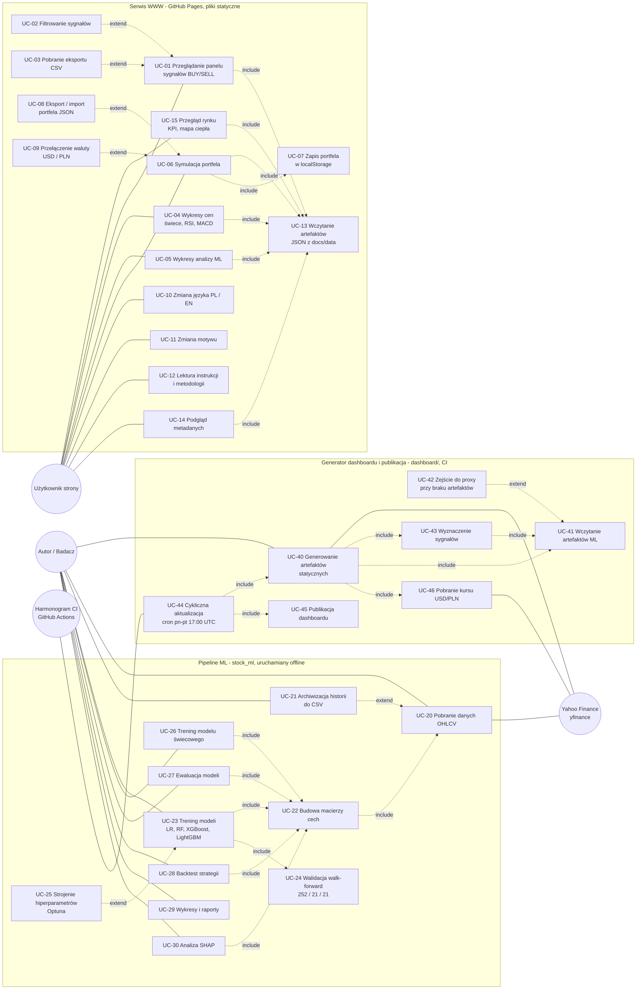
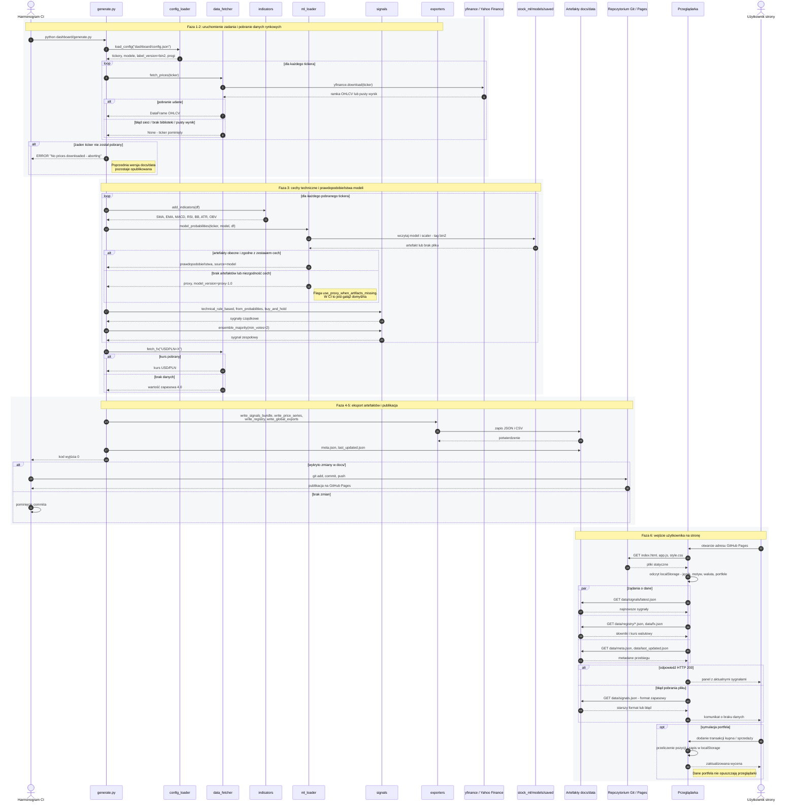
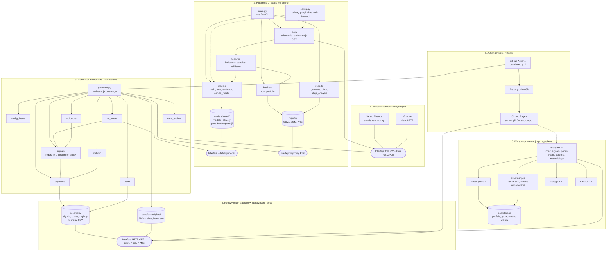

# Dokumentacja inżynierska systemu StocKK Forecast

Katalog `docs/engineering/` zawiera dokumentację projektową powstałą na potrzeby rozdziału
„Inżynieria oprogramowania" pracy inżynierskiej *Prognozowanie krótkoterminowych zmian cen akcji
giełdowych z wykorzystaniem metod uczenia maszynowego oraz symulacja strategii inwestycyjnej*
(Kajetan Kaczyński, Uniwersytet Przyrodniczy w Poznaniu).

## Zawartość katalogu

| Plik | Opis |
|------|------|
| `uml_use_case.puml` | Diagram przypadków użycia w notacji PlantUML |
| `uml_sequence.puml` | Diagram sekwencji dla cyklicznej aktualizacji dashboardu i odczytu danych przez użytkownika |
| `uml_components.puml` | Diagram komponentów przedstawiający warstwy systemu |
| `README.md` | Ten dokument — te same trzy diagramy w notacji Mermaid, renderowane bezpośrednio przez GitHub |
| `WYMAGANIA.md` | Rozdział z wymaganiami funkcjonalnymi i niefunkcjonalnymi wraz z macierzą pokrycia |

Pliki `.puml` są źródłem diagramów w jakości nadającej się do druku. Można je wygenerować lokalnie:

```bash
plantuml -tsvg docs/engineering/uml_use_case.puml
plantuml -tsvg docs/engineering/uml_sequence.puml
plantuml -tsvg docs/engineering/uml_components.puml
```

Poniższe wersje w notacji Mermaid są renderowane przez GitHub bez dodatkowych narzędzi i służą
do szybkiego podglądu w przeglądarce.

## Krótka charakterystyka systemu

StocKK Forecast składa się z trzech niezależnie uruchamianych części:

1. **Pipeline uczenia maszynowego (`stock_ml/`)** — uruchamiany lokalnie przez autora, pobiera
   notowania z Yahoo Finance, buduje macierz cech (ok. 30 wskaźników technicznych oraz cechy
   świecowe), trenuje pięć wariantów klasyfikatorów w schemacie walidacji kroczącej
   (*walk-forward*), zapisuje modele oraz skalery na dysku lokalnym i generuje raporty.
2. **Generator dashboardu (`dashboard/`)** — uruchamiany cyklicznie przez GitHub Actions, pobiera
   bieżące notowania, wyznacza sygnały BUY/SELL (reguły techniczne, modele ML, głosowanie
   większościowe, benchmark *buy & hold*) i zapisuje wyniki jako statyczne pliki JSON i CSV
   w katalogu `docs/data/`.
3. **Serwis WWW (`docs/`)** — statyczne strony hostowane na GitHub Pages. Cała logika działa
   po stronie przeglądarki; system nie ma back-endu, bazy danych ani kont użytkowników.

---

## 1. Diagram przypadków użycia

Mermaid nie posiada natywnej notacji diagramu przypadków użycia, dlatego poniższy diagram
odwzorowuje jego strukturę za pomocą grafu skierowanego: aktorzy znajdują się po lewej stronie,
przypadki użycia zostały pogrupowane w trzy granice systemu, a relacje `<<include>>`
i `<<extend>>` opisano etykietami krawędzi. Wersja kanoniczna znajduje się w pliku
`uml_use_case.puml`.



### Jak czytać ten diagram

- **Aktorzy.** *Użytkownik strony* to anonimowy odwiedzający — system nie zna jego tożsamości,
  ponieważ nie istnieje mechanizm rejestracji. *Autor / Badacz* uruchamia pipeline ML na własnej
  stacji roboczej. *Harmonogram CI* jest aktorem systemowym inicjującym aktualizację danych.
  *Yahoo Finance* jest systemem zewnętrznym, z którego pobierane są notowania.
- **Granice systemu.** Trzy prostokąty odpowiadają trzem katalogom repozytorium (`docs/`,
  `stock_ml/`, `dashboard/`) i jednocześnie trzem odrębnym środowiskom uruchomieniowym:
  przeglądarce użytkownika, stacji autora oraz maszynie wirtualnej GitHub Actions.
- **Relacja `<<include>>`** oznacza zachowanie obowiązkowe. Każde wyświetlenie danych na stronie
  wymaga wcześniejszego wczytania artefaktów JSON (UC-13), a trening modelu zawsze obejmuje
  budowę macierzy cech (UC-22) i walidację kroczącą (UC-24).
- **Relacja `<<extend>>`** oznacza zachowanie opcjonalne, uruchamiane po spełnieniu warunku
  rozszerzenia. Najistotniejszym przypadkiem jest UC-42: gdy w środowisku CI brakuje plików
  modeli lub zestaw cech nie zgadza się z zapisanym skalerem, generator przechodzi na
  deterministyczne funkcje proxy.
- **Rozdzielenie UC-23 i UC-40** odzwierciedla fakt, że modele nie są trenowane w CI —
  katalog `stock_ml/models/saved/` jest objęty plikiem `.gitignore`.

---

## 2. Diagram sekwencji

Scenariusz obejmuje pełny cykl życia danych: od uruchomienia zadania cyklicznego, przez pobranie
notowań, wyznaczenie sygnałów i publikację artefaktów, aż po wczytanie plików JSON przez
przeglądarkę odwiedzającego. Wersja kanoniczna znajduje się w pliku `uml_sequence.puml`.



### Jak czytać ten diagram

- **Podział na fazy.** Sześć faz odpowiada kolejnym etapom przebiegu: konfiguracja, pobranie
  danych, przetwarzanie, eksport, publikacja i konsumpcja danych przez użytkownika. Fazy 1–5
  wykonują się bez udziału człowieka, faza 6 dopiero po wejściu odwiedzającego na stronę.
- **Rozdzielenie w czasie.** Między fazą 5 a 6 może upłynąć dowolnie dużo czasu — użytkownik
  zawsze ogląda stan zamrożony w momencie ostatniego commita, a nie stan bieżący rynku.
  Znacznik czasu tej wersji danych publikowany jest w pliku `last_updated.json` (UC-14).
- **Pierwszy blok `alt`** dotyczy pojedynczego tickera: nieudane pobranie powoduje jego
  pominięcie, a nie przerwanie całego przebiegu. Dopiero brak *wszystkich* notowań przerywa
  zadanie bez commita, dzięki czemu poprawne dane nie zostają nadpisane pustym zestawem.
- **Drugi blok `alt`** przedstawia zejście do proxy. Jest to kluczowa decyzja architektoniczna:
  ponieważ artefakty ML nie trafiają do repozytorium, w środowisku CI wykonywana jest gałąź
  proxy, a wynikowy sygnał jest oznaczany wartością `proxy-1.0` w polu `model_version`.
- **Blok `par`** oznacza równoległe żądania HTTP wykonywane przez przeglądarkę. Pliki są od
  siebie niezależne, więc nie występuje efekt kaskady żądań.
- **Blok `opt`** obejmuje symulację portfela — funkcję opcjonalną, w całości klienta,
  bez komunikacji z jakimkolwiek serwerem aplikacyjnym.

---

## 3. Diagram komponentów

Diagram przedstawia sześć warstw systemu wraz z kierunkami zależności oraz interfejsami,
przez które warstwy się komunikują. Wersja kanoniczna znajduje się w pliku `uml_components.puml`.



### Jak czytać ten diagram

- **Kierunek zależności.** Strzałki prowadzą wyłącznie „w dół" łańcucha przetwarzania: warstwa
  prezentacji zależy od repozytorium artefaktów, repozytorium od generatora, generator od
  pipeline'u ML i źródła danych. Nie występuje zależność zwrotna — strona nie może wywołać
  żadnej funkcji generatora ani modelu.
- **Interfejsy.** Zaokrąglone elementy oznaczają punkty styku między warstwami. Interfejs
  `HTTP GET` jest jedynym sposobem, w jaki przeglądarka komunikuje się z danymi; interfejs
  `artefakty modeli` jest dostępny wyłącznie na stacji autora, ponieważ katalog
  `stock_ml/models/saved/` nie jest wersjonowany.
- **Brak komponentów serwerowych.** Na diagramie nie ma serwera aplikacyjnego ani bazy danych,
  co jest świadomą decyzją projektową. Konsekwencją jest brak kont użytkowników i przechowywanie
  stanu portfela wyłącznie w `localStorage` przeglądarki.
- **Rola warstwy 6.** GitHub Actions pełni funkcję planisty, a GitHub Pages funkcję serwera
  plików statycznych. Obie usługi są wymienne — system można opublikować na dowolnym hostingu
  statycznym, co opisano w wymaganiu przenośności w pliku `WYMAGANIA.md`.
- **Powiązanie z pipeline'em ML.** Warstwa 2 jest jedynym producentem artefaktów modeli.
  Ponieważ w środowisku CI te artefakty są niedostępne, komponent `ml_loader` implementuje
  ścieżkę zapasową opisaną na diagramie sekwencji.
